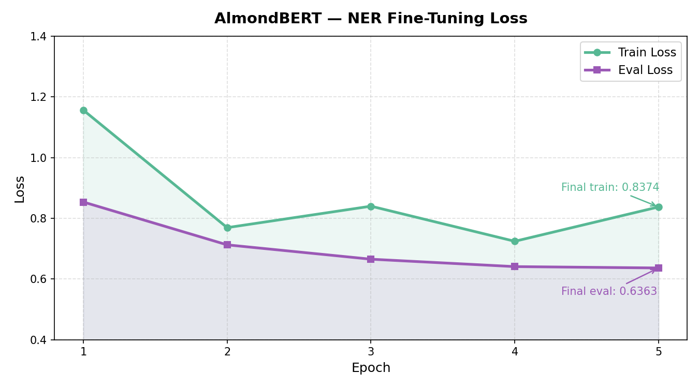

# Named Entity Recognition — AlmondBERT Downstream Task

> *Pre-training gives the model language. Fine-tuning gives it a job.*

---

## What is Task Adaptation?

After pre-training, AlmondBERT has learned general language representations — it understands context, syntax, and semantics from reading 50k Wikipedia sentences. But it doesn't know what to *do* with that understanding yet.

Task adaptation (fine-tuning) adds a small task-specific head on top of the pre-trained encoder and trains on labeled data. The encoder's weights are updated (not frozen) — the pre-trained representations are refined toward the task.

**Tasks BERT-style models can be adapted to:**

| Task | Input | Output | Example |
|------|-------|--------|---------|
| **NER** | sentence | label per token | "India" → B-LOC |
| **Sentiment Analysis** | sentence | single label | "great movie" → positive |
| **Text Classification** | sentence | single label | spam / not spam |
| **Question Answering** | question + context | span (start, end) | SQuAD |
| **Semantic Similarity** | two sentences | similarity score | STS-B |
| **Natural Language Inference** | premise + hypothesis | entail / neutral / contradict | MNLI |
| **Text Summarization** | long text | shorter text | (encoder only = retrieval, not abstractive) |

Each task uses the same pre-trained encoder — only the head changes.

---

## Named Entity Recognition (NER)

NER is a **token-level classification** task. Every token in a sentence receives a label indicating what kind of entity it is (or isn't).

**Entity types in CoNLL-2003:**

```
O     → not an entity ("the", "is", "at")
B-LOC → beginning of a location entity
I-LOC → continuation of a location entity
B-ORG → beginning of an organization entity
I-ORG → continuation of an organization entity
B-PER → beginning of a person entity
I-PER → continuation of a person entity
```

**B- vs I- prefix:**

B- marks the **first token** of a multi-token entity. I- marks every **subsequent token** of the same entity. This is the BIO (Beginning-Inside-Outside) tagging scheme.

```
"New  York  City  is  a  LOC"
 B-LOC I-LOC I-LOC O  O  O
```

Without B/I distinction, the model couldn't tell whether two adjacent entities are one entity or two separate ones:

```
"John Smith John Doe"
 B-PER I-PER B-PER I-PER   ← two people
 B-PER I-PER I-PER I-PER   ← ambiguous without B-
```

---

## Architecture — NER Head

For NER, every token needs a label — so we use every token's output representation, not just [CLS]:

```
Input tokens: [CLS] tok1 tok2 tok3 ... tokN [SEP]
                ↓    ↓    ↓    ↓         ↓    ↓
Encoder output: h0   h1   h2   h3  ...  hN   hN+1
                      ↓    ↓    ↓         ↓
NER head:         Linear(embed_dim, num_labels)
                      ↓    ↓    ↓         ↓
Logits:           label label label ... label
```

[CLS] and [SEP] positions are ignored during loss computation (label = -100).

**Why not use [CLS] for NER?**

[CLS] captures sentence-level representation — useful for classification tasks. NER needs token-level representation — each token's hidden state carries its local and contextual information. The NER head applies directly to each token's output.

---

## Subword Alignment — The Tricky Part

CoNLL-2003 labels are at the **word** level. BPE tokenizer splits words into **subwords**. This creates a mismatch:

```
Word    : "Washington"   Label: B-LOC
Subwords: ["Wash", "##ington"]

Which subword gets B-LOC?
```

**Solution: first-token labeling.**

Only the first subword of each word receives the real label. All subsequent subwords get label -100 (ignored during loss):

```
Word    : Washington    New    York
Subwords: Wash ##ington New    York ##s
Labels  : B-LOC -100   B-LOC  I-LOC -100
```

During evaluation, predictions are mapped back to word level — only the first subword's prediction counts for the word.

---

## Dataset

**Wikiann-NER** — Wikipeda text, manually annotated for NER.

```python
from datasets import load_dataset
ds = load_dataset("kyrgyz-bench-data-wikiann-ner")
# train: 14,041 sentences
# validation: 3,250 sentences
# test: 3,684 sentences
```

AlmondBERT fine-tuning used:
- Train: 20,000 samples (train split)
- Validation: 10,000 samples (validation split)

**Label distribution:**

```
O      → majority (most tokens are not entities)
B-PER  → 4,523 entities
B-ORG  → 4,738 entities
B-LOC  → 4,650 entities
```

---

## Training Config

```yaml
num_epochs    : 5
learning_rate : 2e-5   (smaller than pre-training — avoid catastrophic forgetting)
batch_size    : 32
optimizer     : AdamW
loss          : CrossEntropy with ignore_index=-100
```

**Why small learning rate for fine-tuning?**

The pre-trained encoder has already learned useful representations. A large LR would overwrite them — this is catastrophic forgetting. A small LR nudges the weights toward the task without destroying the general representations.

---

## Loss Curve



| Epoch | Train Loss | Eval Loss |
|-------|-----------|----------|
| 1 | 1.1564 | 0.8536 |
| 2 | 0.7692 | 0.7125 |
| 3 | 0.8399 | 0.6652 |
| 4 | 0.7242 | 0.6408 |
| 5 | 0.8374 | 0.6363 |

Eval loss consistently decreases across all epochs. Train loss oscillates slightly — expected with the class imbalance (O tokens dominate, making gradients noisy on minority entity classes).

---

## Results

```
Precision : 0.2912
Recall    : 0.4157
F1        : 0.3425
```

**Per entity type:**

| Entity | Precision | Recall | F1 |
|--------|-----------|--------|-----|
| LOC | 0.3349 | 0.4256 | 0.3748 |
| ORG | 0.2012 | 0.3014 | 0.2413 |
| PER | 0.3470 | 0.5253 | 0.4179 |

**Sample predictions:**

```
TOKENS: ['Shortly', 'afterward', ',', ..., 'India', ';', ..., 'Adyar', ...]
GOLD  : [..., 'B-LOC', ..., 'B-LOC', ...]
PRED  : [..., 'O', ..., 'B-LOC', ...]          ← missed "India", got "Adyar"

TOKENS: ['Kanye', 'West', 'featuring', 'Jamie', 'Foxx', ...]
GOLD  : ['B-PER', 'I-PER', 'O', 'B-PER', 'I-PER', ...]
PRED  : ['B-ORG', 'I-ORG', 'O', 'I-ORG', 'I-ORG', ...]  ← entity type confusion

TOKENS: ['Blacktown', 'railway', 'station']
GOLD  : ['B-ORG', 'I-ORG', 'I-ORG']
PRED  : ['B-ORG', 'I-ORG', 'I-ORG']                      ← correct ✓
```

---

## Analysis — Why F1 0.34?

**Honest assessment — three contributing factors:**

**1. BPE subword fragmentation**

As discussed in pretrain.md — BPE can split entity names into non-meaningful fragments. "Fischler" might become ["Fis", "##chler"]. The model predicts the entity type from a partial token representation, which is harder than predicting from a full WordPiece token.

**2. Model scale**

AlmondBERT has ~10-15M parameters. BERT-base has 110M. More parameters = richer representations = better entity boundary detection. At 10-15M, the model has limited capacity to simultaneously learn syntax, semantics, and entity recognition.

**What the results do show:**

- Recall (0.4157) > Precision (0.2912) — the model finds entities but mislabels their type
- PER (0.4179 F1) > LOC (0.3748) > ORG (0.2413) — person names are most consistent across pre-training and fine-tuning data
- ORG is hardest — organization names are most domain-specific and varied

---

## What I Learned

The gap between pre-training loss and downstream performance is real and humbling. A model that learned to predict masked tokens reasonably well still struggles at entity recognition — because entity boundaries require understanding that goes beyond word co-occurrence.

The most important lesson: **the quality of pre-training representations directly determines the ceiling of fine-tuning performance.** You can't fine-tune your way out of bad pre-training. Better corpus (more entity-dense), larger model, and longer training would all raise that ceiling before fine-tuning even starts.

The second lesson: **task adaptation is about alignment, not transformation.** Fine-tuning doesn't teach the model what a location is from scratch — it teaches the model to map its existing representations of "India" and "London" to the label B-LOC. If those representations are already good (close together in embedding space, distinct from non-locations), fine-tuning is easy. If they're noisy, no amount of fine-tuning epochs will fix it.
