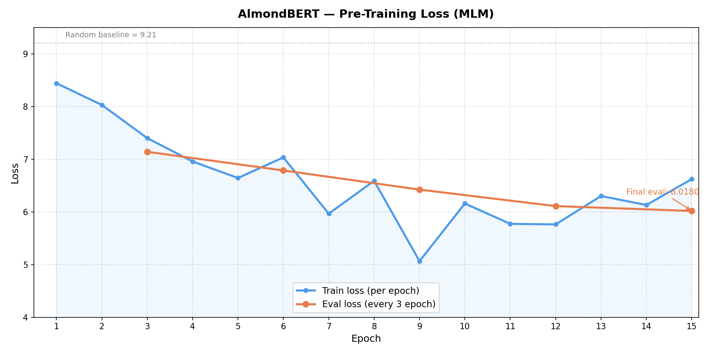

# Pre-Training — AlmondBERT

> *BERT is not about generating — it's about understanding. Every design choice here reflects that.*

---

## Why BERT, Not GPT?

GPT is a decoder — it generates tokens one by one, left to right. It only sees what came before. That's great for generation, but terrible for understanding the full meaning of a sentence.

BERT is an encoder — it reads the entire sentence at once, bidirectionally. Every token attends to every other token simultaneously. This makes BERT fundamentally better at tasks that require understanding context from both sides: "The bank by the river" vs "The bank approved my loan" — BERT knows which "bank" it is. GPT at position 1 doesn't.

The trade-off: BERT can't generate. It produces representations, not text.

---

## Pre-Training Objective — Masked Language Modeling (MLM)

Instead of predicting the next token, BERT predicts randomly masked tokens within a sentence.

**Masking strategy per sentence:**

```
15% of tokens are selected for masking:
├── 80% → replaced with [MASK]
├── 10% → replaced with a random token from vocab
└── 10% → left unchanged (the model doesn't know which ones are "real")
```

**Why the 80/10/10 split?**

If 100% of selected tokens were replaced with [MASK], the model would learn that [MASK] always means "something to predict" and would never develop good representations for real tokens — because [MASK] never appears at inference time.

The 10% random token forces the model to maintain a representation for every token, not just masked ones. The 10% unchanged forces the model to be robust — it can't rely on [MASK] as a signal.

**Example:**

```
Original : "The European Commission said on Thursday it disagreed."
Masked   : "The [MASK] Commission said on Thursday it [MASK]."
Target   : predict "European" and "disagreed" at masked positions
Loss     : CrossEntropy only at masked positions (label = -100 elsewhere)
```

---

## Architecture — What's Modern, What's Standard

AlmondBERT uses a mix of modern improvements and standard components.

### RoPE — Rotary Positional Encoding

Vanilla BERT uses Learned Positional Encoding (LPE) — each position gets a learned vector. The problem: positions are inconsistent across batches. The model has to re-learn where tokens are relative to each other every time it sees a new sequence. And at inference, if the model encounters a sequence longer than it was trained on — it breaks.

RoPE fixes this with trigonometry. Instead of learning positions, it *rotates* the query and key vectors by an angle proportional to their position:

```
q_rotated = q * cos(θ) + rotate_half(q) * sin(θ)
k_rotated = k * cos(θ) + rotate_half(k) * sin(θ)
```

The key insight: **what matters is not the absolute position, but the relative distance between two tokens.** If "New" and "York" are always distance 1 apart — it doesn't matter if they're at position 1-2 or position 50-51. RoPE encodes that distance as a rotation, and rotation is consistent regardless of where in the sequence the tokens appear.

Two tokens that always appear together will always rotate by the same relative angle — their dot product in attention will be large, meaning the model recognizes their relationship is strong.

---

### Alternating Attention — Local + Global

Standard MHA has O(N²) complexity — every token attends to every other token. For short sequences this is fine. For long sequences (1024+ tokens), this becomes a memory and compute problem.

AlmondBERT uses **alternating attention**, inspired by ModernBERT:

```
Even blocks  → Global attention  (attend to all tokens)
Odd blocks   → Local attention   (attend to sliding window W tokens only)
```

Global attention stays O(N²) but only runs every other block. Local attention is O(N×W) — linear in sequence length for a fixed window size W.

The intuition: you don't need full context at every layer. Local attention captures fine-grained syntax and word relationships. Global attention periodically pulls the big picture together. Together they give the model both local detail and global coherence — at a fraction of the compute cost.

---

### Unpadding

In a standard batch, sequences are padded to the same length:

```
Batch:
Sentence 1: [tok1, tok2, tok3, PAD, PAD, PAD]  ← 3 real, 3 wasted
Sentence 2: [tok1, tok2, tok3, tok4, tok5, PAD] ← 5 real, 1 wasted
```

The model computes attention for every position including padding — wasting compute on tokens that contribute nothing.

Unpadding removes all padding tokens before entering attention, flattening the batch from `(B, T, C)` to `(TotalTokens, C)`:

```
Unpadded: [tok1, tok2, tok3, tok1, tok2, tok3, tok4, tok5]
           ↑ sentence 1 ↑    ↑        sentence 2        ↑
```

The challenge: after flattening, the model must not let sentence 2 attend to sentence 1's tokens. This is handled by a custom attention mask built from batch IDs:

```python
# Each token knows which sentence it came from (batch_id)
# Attention is only allowed between tokens with the same batch_id
same_batch_ids = (valid_batch_ids.unsqueeze(0) == valid_batch_ids.unsqueeze(1))

unpad_attn_mask = torch.zeros(same_batch_ids.shape, ...)
unpad_attn_mask = unpad_attn_mask.masked_fill(~same_batch_ids, float("-inf"))
```

Tokens from different sentences get `-inf` attention score → after softmax they become 0 → no cross-sentence information leaks.

---

### Flash Attention (FA)

FA is not part of the model architecture — it's a **CUDA-level algorithm optimization** for computing attention faster and with less memory.

Standard attention computes `softmax(QKᵀ/√d) × V` by materializing the full N×N attention matrix in HBM (High Bandwidth Memory — the slow GPU memory). For long sequences, this N×N matrix is huge and reading/writing it to HBM repeatedly becomes the bottleneck.

FA sidesteps this by using **tiling** — it splits Q, K, V into small blocks that fit entirely in SRAM (the fast on-chip memory, like CPU registers). Each tile is computed entirely in SRAM without touching HBM, using a running global max and global sum to maintain numerical stability across tiles.

The result: same mathematical output as standard attention, but memory usage drops from O(N²) to O(N) and throughput increases significantly — because SRAM is orders of magnitude faster than HBM.

In short: FA is a smarter way to run the same computation. The model doesn't change, the math doesn't change — only where and how the computation happens.

---

### GeGLU — Gated FFN

Standard FFN:
```
output = Linear(ReLU(Linear(x)))
```

ReLU hard-kills everything below zero — any weight that goes negative is immediately zeroed out. This is too aggressive.

GeGLU uses a gating mechanism with three matrices:

```
gate   = GELU(Linear(x))   ← soft gate with gradient through negatives
value  = Linear(x)          ← raw information, no activation
output = Linear(gate * value)
```

The gate controls how much of the value passes through. GELU gives a smooth, differentiable gate — unlike ReLU, values slightly below zero still have gradient, so the model can learn to recover them if they're important.

Why three matrices instead of two? To keep parameter count equivalent to standard 4× expansion FFN:

```
Standard: Linear(d, 4d) + Linear(4d, d) → 8d² parameters
GeGLU:    gate(d, 8d/3) + value(d, 8d/3) + out(8d/3, d) → 8d² parameters
```

The 8/3 factor preserves total parameter count.

---

## Dataset

**Tokenizer training + MLM pre-training:** Wikipedia Simple English — sent_tokenize'd into individual sentences (~50k sentences).

**Why sent_tokenize, not splitlines?**

Unlike GPT where a continuous token stream is fine (cross-sentence context is acceptable), BERT processes each sentence as a standalone unit. The model must not carry context across sentence boundaries inside a single sample. `sent_tokenize` from NLTK ensures each line is a complete, meaningful sentence.

**Why not the same corpus as GPT (TinyStories)?**

TinyStories is children's fiction — simple vocabulary, repetitive structure. Wikipedia has entity-rich, factual text. Since the downstream task is NER (named entity recognition), pre-training on entity-dense text gives the model better initial representations for names, places, and organizations.

**Tokenizer:** BPE (byte-level), reused from AlmondGPT with additional special tokens:

```
[CLS]  → prepended to every sequence, captures sentence-level representation
[SEP]  → appended to every sequence, marks end of input
[MASK] → replaces selected tokens during MLM training
[PAD]  → pads shorter sequences to batch length
```

---

## Training Config

```yaml
vocab_size    : 10887  (actual after BPE early-stop)
embed_dim     : 256
n_heads       : 8
n_blocks      : 6
max_len       : 128
batch_size    : 64
learning_rate : 1e-4
epochs        : 15
optimizer     : AdamW
```

---

## Loss Curve



| Epoch | Train Loss | Eval Loss (every 3 epochs) |
|-------|-----------|---------------------------|
| 1 | 8.4425 | — |
| 2 | 8.0304 | — |
| 3 | 7.4008 | 7.1409 |
| 6 | 7.0352 | 6.7867 |
| 9 | 5.0658 | 6.4233 |
| 12 | 5.7631 | 6.1101 |
| 15 | 6.6235 | 6.0180 |

**Random baseline:** `ln(10887) ≈ 9.29` — model starts well below this, confirming BPE tokenizer and architecture are correctly wired.

**Final eval loss: 6.0180** — a ~3.3 point improvement from random baseline. The model has learned meaningful token co-occurrence patterns and contextual representations.

Train loss oscillates more than eval loss — expected with dynamic masking (different tokens are masked each epoch), combined with no learning rate warmup in later epochs.

---

## Key Insight — BPE + MLM Trade-off

BPE tokenizer splits words into subword units based on frequency:

```
"Washington" → ["Wash", "##ington"]
```

When MLM masks "Wash", the model must predict a byte-fragment — not a meaningful linguistic unit. This is why BERT original used **WordPiece** (merge by probability, not frequency) — WordPiece tokens tend to be more linguistically meaningful.

The mitigation used in production is **Whole Word Masking** — if any subword of a word is selected for masking, all its subwords are masked together. AlmondBERT does not implement this, which contributes to higher pre-training loss compared to WordPiece-based models.

**However:** for downstream task performance, this matters less than it seems. The representations learned during pre-training are still useful — the model still learns contextual embeddings that carry semantic information, even if individual MLM predictions are noisier.

---

## What I Learned

The biggest gap between GPT and BERT is not the architecture — it's the **objective**. GPT always has a clear ground truth: the next token. BERT's masked token can be ambiguous — multiple tokens could plausibly fill a [MASK] slot. This inherent ambiguity is why BERT loss stays higher than GPT loss even when training is going well.

The second lesson: encoder representations are richer than decoder representations at the same scale. BERT sees the full sentence. GPT at any position only sees half of it. That bidirectionality is expensive to train (quadratic attention, no caching), but the representations you get are worth it for understanding tasks.
